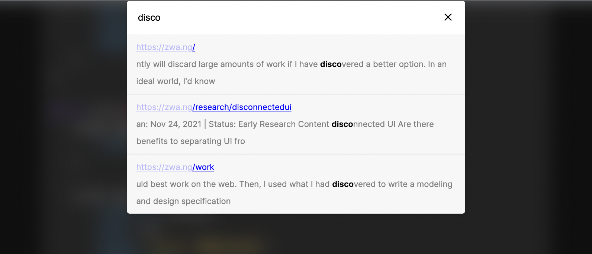

# ctrl-shift-f (for chrome)
chrome extension to full text search all pages of a website you've been to



> Bon Voyage Hacks II

> LaunchHacks

## Contributing
install pnpm and dependencies
```
npm install pnpm -g
pnpm i
```
build extension
```
pnpm run build
```

1. go to [chrome://extensions](chrome://extensions) and turn on turn on developer mode
2. click load unpacked and select this repository's folder
3. when you make an update, rebuild the extension with `pnpm run build` and click the reload button in chrome://extensions